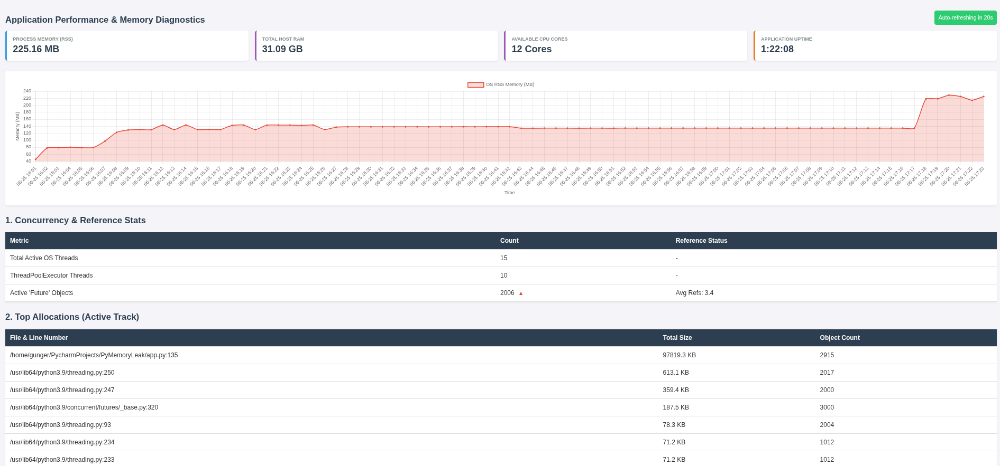

# FastAPI Memory Profiler

A lightweight, drop-in utility for FastAPI applications to diagnose and isolate memory leaks in real-time. It aggregates OS-level RSS memory, Python C-level allocations (`tracemalloc`), and Python object-level tracking (`pympler`) into a live, auto-refreshing dashboard.

## Prerequisites

Because the tool generates visual object reference graphs, it requires the system-level `graphviz` package alongside Python dependencies.

**System Requirements (RHEL/CentOS):**
```bash
sudo dnf install graphviz
```

Python Dependencies:
```bash
pip install fastapi psutil pympler objgraph graphviz
```

# FastAPI Memory Profiler

A lightweight, drop-in utility for FastAPI applications to diagnose and isolate memory leaks in real-time. It aggregates OS-level RSS memory, Python C-level allocations (`tracemalloc`), and Python object-level tracking (`pympler`) into a live, auto-refreshing dashboard.

## Prerequisites

Because the tool generates visual object reference graphs, it requires the system-level `graphviz` package alongside Python dependencies.

**System Requirements (RHEL/CentOS):**
```bash
sudo dnf install graphviz
```

Python Dependencies:
```bash
pip install fastapi psutil pympler objgraph graphviz
```

> ⚠️ **CAUTION: System-Level Graphviz is Mandatory**
> 
> While this package installs the Python `graphviz` library via `pip`, that library is **only a wrapper**. It cannot draw the memory graphs without the underlying C-binaries installed on your operating system.
>
> If you deploy this tool but skip the OS-level installation, any request to the `/debug/memory/objgraph/{obj_type}` route will fail and throw an `ExecutableNotFound` error.
> 
> Always ensure your server, Dockerfile, or local environment installs the system package before running the FastAPI application:
> * **RHEL/CentOS:** `sudo dnf install graphviz`
> * **Ubuntu/Debian:** `sudo apt-get install graphviz`
> * **macOS:** `brew install graphviz`
> * **Alpine (Docker):** `apk add graphviz`


## Integration     
The profiler is built as an independent FastAPI APIRouter.      
To inject it into any existing application, drop memory_profiler.py into your project and add the following two lines to your main application file (e.g., main.py or app.py):
```python
from fastapi import FastAPI
from memory_profiler import memory_router # 1. Import the utility

app = FastAPI()

app.include_router(memory_router) # 2. Inject the debugging routes
```

## Endpoints       
Once your FastAPI server is running, the following profiling routes are exposed:

| Endpoint                           | Description                                                                                                  |
|------------------------------------|--------------------------------------------------------------------------------------------------------------|
| /debug/memory/dashboard/html       | A human-readable, auto-refreshing UI. Supports a ?refresh=X query parameter (default is 30 seconds).         |
| /debug/memory/dashboard            | Returns the raw JSON dashboard metrics. Useful for automated monitoring scripts.                             |
| /debug/memory/objgraph/{obj_type}  | Generates and downloads a .png reference graph for the requested object type (e.g., /objgraph/KeycloakUser). |
| /debug/memory/clear-tracemalloc | Resets the tracemalloc baseline to zero.                                                                     |


## Features
### Historical Memory Tracking (Time-Series)

Standard profilers only show you a point-in-time snapshot, making it difficult to differentiate between healthy Python Garbage Collection sweeps and a slow, creeping memory leak. 

To solve this, the profiler automatically spins up a lightweight, daemonized background thread upon import. 
* **3-Day Rolling Window:** It silently polls your OS RSS memory every 60 seconds and stores it in a bounded `deque` (maximum 4,320 data points). 
* **Zero-Leak Guarantee:** Because the queue is strictly bounded, the historical tracker will never cause a memory leak itself.
* **Interactive Visualization:** The `/dashboard/html` route renders this history using `Chart.js`. Even if you leave the dashboard closed all weekend, opening it on Monday will instantly draw the full 72-hour memory curve.

### Live Trend Indicators (Deltas)

The dashboard includes stateful momentum tracking to help you spot anomalous allocations out of the corner of your eye. Every time the dashboard refreshes, it compares the current snapshot against the previous one:

* 🔺 **Red Up Arrow:** The count or size has increased since the last refresh. (Useful for spotting active hoarding during load testing).
* 🔻 **Green Down Arrow:** The count has decreased. (Validates that Garbage Collection is successfully sweeping your objects).
* **No Arrow:** The metric is perfectly stable.

These indicators are applied automatically to **Active OS Threads**, **ThreadPoolExecutor Threads**, **'Future' Objects**, and every individual object type tracked in the **Objects In Memory Heap** table.

### System Vitals Grid

To provide context to your memory footprint, the dashboard features a top-level vitals grid that displays:
* **Process Memory (RSS):** What your specific container/process is using.
* **Total Host RAM:** The maximum hardware limit of the machine.
* **Available CPU Cores:** Useful for understanding ThreadPool capacity.
* **Application Uptime:** Correlates directly with the time-series chart to prove long-term stability.



## How to Read the Data (The Golden Rules)     
Finding a memory leak requires cross-referencing the Top Allocations table with the Objects in Memory table.

1. Identifying the Leak
- **Watch the Dashboard:** Trigger traffic to your application. If a specific class or built-in type (`dict`, `str`, `set`) continuously climbs in the Objects in Memory table and never drops back down, you have a leak.

- **Allocation vs. Assignment:** The Top Allocations table shows where the heavy memory was allocated (e.g., `permissions = [data]`). This is usually just above the line of code where the actual leak happens (e.g., appending that variable to a global cache, list, or stranded background thread).

2. Using the Grapher (`/objgraph`)
- **Rule for Custom Classes:** If a custom class (e.g., `MyRedisConnection`, `KeycloakModel`) is leaking, pass its exact name to the `/objgraph/{type}` endpoint. Trace the arrows from the red box backwards to find the global variable, pool, or cache holding it hostage.

- **Rule for Built-ins:** Do not use objgraph for generic types like dict, list, or str. Python relies on tens of thousands of healthy dictionaries to run. Instead, rely on the Top Allocations line numbers to find where the generic data is being appended.
